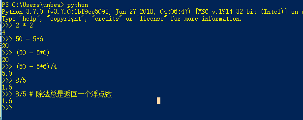
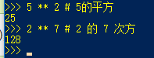
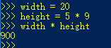
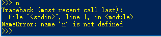
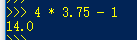
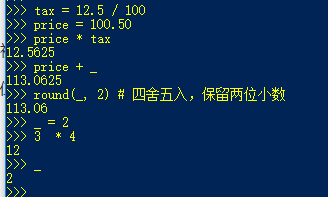

# 3. 一个 Python 非正式的介绍

在接下来的例子中，输入和输出的区别是根据有没有提示符（>>> 或者 ...）。一行前面没有提示符的是输出。

注释使用 # 表示。从 # 号开始到这行的结束都是注释。注释会被解释器忽略。注释可以用来对代码做一些介绍。

但在字符串中的 # 号，不会被认为是注释。

以下是注释的例子：

```python
# 这是第一句注释
spam = 1  # 这是第二句注释
          # ... 和现在是第三句注释
text = "# 这不是注释，因为在字符串里面."
```

## 3.1 使用 Python 作为计算器

### 3.1.1 数

使用 Python 交互解释器作为一个简单的计算器。你可以输入一个表达式来算出结果。表达式语法是简单的：操作符有 +，-，*，/。这些操作符就像C语言一样，括号 () 用来分组。

例子：



整数类型 int 如 2，4，20，有一个小数点的叫做浮点型 float。


除法 / 总是返回一个浮点数。如果除法想要得到一个整数，并且想要忽略小数点后面的数可以采用地板除（//）。

想要得到余数采用 %。如下例所示：


计算某个数的幂次方采用 **




等于号 = 被用作赋值给一个变量。例子如下：




如果一个变量没有赋值而使用会报错误，例：




完全支持浮点数，整数和浮点数相运算，会将整数转换为浮点数。




在交互模式下，最后一个被打印出来的值会赋值给变量 _ ，这意味着在交互模式下可以更方便的使用计算器。

但是，如果你给变量 _ 赋值，这个魔法效果将会失效。例如：




除了 int 和 float, Python 还支持其他数的类型，如 Decimal 和 Fraction。Python 还内置了支持虚数类型。使用 j 或者 J 表示虚的部分。如 3 + 5j。


### 3.1.2 字符串


