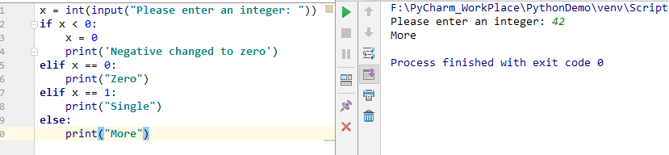
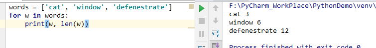
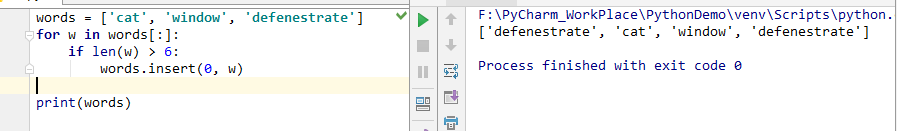

# 4. 更多控制流程工具

除了刚才介绍的 while 语句， Python 知道其他语言的控制流程语句，并和他们的控制流程语句有一些区别

## 4.1. if 语句

可能 if 语句是最出名的语句。例如：

这里可以有 0 个或更多个 elif 部分， 和 else 部分是可选的。 这个关键字 elif 是 else if 的缩写， 而且避免了过度压缩。 这个 if ... elif ... elif ... 序列是其他语言中 swith 或者 case 的替代品。

# 4.2. for 语句

这个 for 语句和你曾在 C 或 Pascal 中用过的  for 有一点不同。 不总是遍历一个数的算术级数 （像 Pascal），或者同时定义迭代步骤和停止条件（如 C），Python 的 for 语句迭代一个序列（list 或者 string）中的每一个元素，按照每一个元素出现的顺序。例如：

如果你需要在遍历过程中修改这个序列（如复制所选元素），推荐你首先复制这个序列。迭代这个序列不会隐式的复制这个序列。 切片操作对于复制来说特别方便。

用 for w in words:，这会创建一个无限大的 list，一直不停的插入 `defenestrate`  。